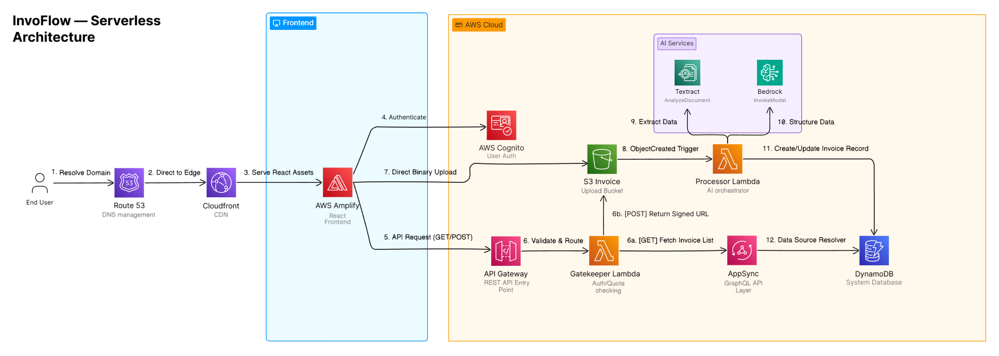

# InvoFlow: AI-Powered Invoice Processing & Backlog Generator

InvoFlow is a full-stack, cloud-native SaaS application designed to automate data extraction from invoices and software specifications. Built with a serverless-first mindset on AWS, it transforms raw PDFs into structured, actionable data using Generative AI.

## 🚀 Features

- **AI-Driven Extraction:** Leverages **Amazon Textract** for OCR and **Amazon Bedrock (Claude 3.5)** for intelligent JSON mapping.
- **The "Gatekeeper" Logic:** Custom middleware handles dual-tier quota enforcement (3 free invoices per user).
- **Secure File Handling:** Implements S3 Pre-signed URLs for direct, secure binary uploads (bypassing Lambda for performance).
- **Production Edge Hosting:** Globally distributed via **Route 53** and **CloudFront** for low-latency delivery and SSL termination.
- **Event-Driven Pipeline:** Fully automated processing triggered by S3 `ObjectCreated` events.

## 🛠 Tech Stack

- **Frontend:** React, TypeScript, Tailwind CSS, AWS Amplify Gen 2
- **Backend:** AWS Lambda (Node.js/TypeScript), Amazon API Gateway
- **Data Layer:** Amazon AppSync (GraphQL), Amazon DynamoDB
- **AI/ML:** Amazon Textract, Amazon Bedrock
- **Infrastructure:** AWS Route 53, CloudFront, Amazon S3, Amazon Cognito

## 🏗 System Architecture

1. **Identity & Routing:** Users resolve via **Route 53** and access the UI through **CloudFront**. Authentication is handled by **Amazon Cognito**.
2. **The Gatekeeper (POST/GET):**
   - **GET:** The Gatekeeper Lambda queries **AppSync** to fetch the user's invoice list.
   - **POST:** The Lambda validates the user's quota (Current Count < 3). If valid, it returns a **Pre-signed S3 URL**.
3. **The Action:** The frontend uploads the PDF directly to **S3** using the signed URL.
4. **The Pipeline:** S3 triggers the **Processor Lambda**, which orchestrates Textract and Bedrock to parse the file.
5. **Storage:** Final structured results are saved via AppSync into **DynamoDB**.

## 🔧 Installation & Setup

### 1. Clone the repository

```bash
git clone https://github.com/yourusername/invoflow.git
cd invoflow
```

### 2. Install dependencies

```bash
npm install
```

### 3. Configure your AWS profile

Make sure you have the AWS CLI installed and a profile configured with the necessary permissions:

```bash
aws configure
```

### 4. Add secrets

Set your Google OAuth credentials using the Amplify secrets manager:

```bash
npx ampx sandbox secret set GOOGLE_CLIENT_ID
npx ampx sandbox secret set GOOGLE_CLIENT_SECRET
```

You will be prompted to enter the value for each secret.

### 5. Deploy Backend (AWS Amplify Gen 2)

```bash
npx ampx sandbox
# or for production
npx ampx pipeline-deploy
```

## 🛡 Security & Quotas

- **Zero-Trust Uploads:** S3 buckets are private; access is granted only via time-limited Pre-signed URLs.
- **Identity Isolation:** All database records are owner-protected via Cognito identity claims.
- **CORS Management:** Securely handled via custom API Gateway headers to support cross-origin requests from the CloudFront domain.